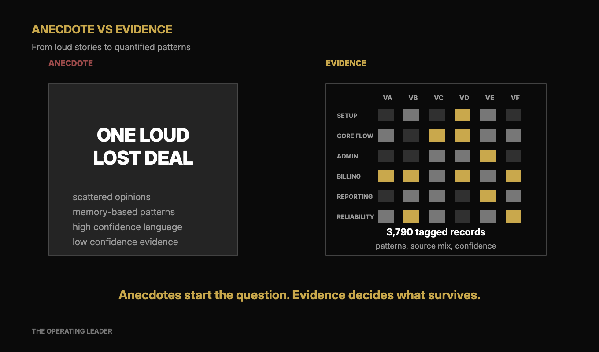
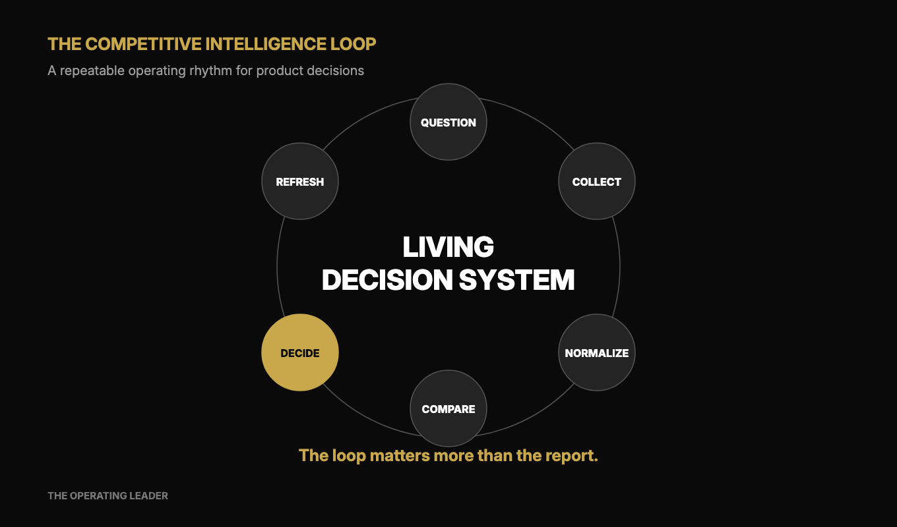
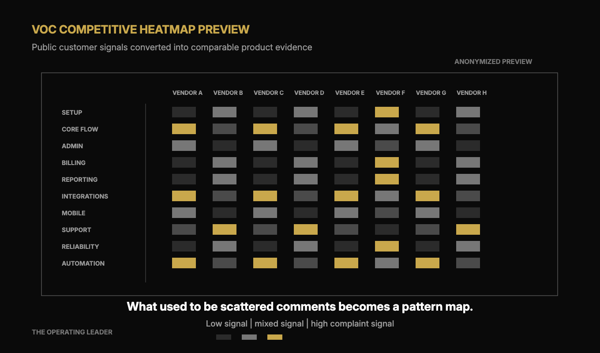
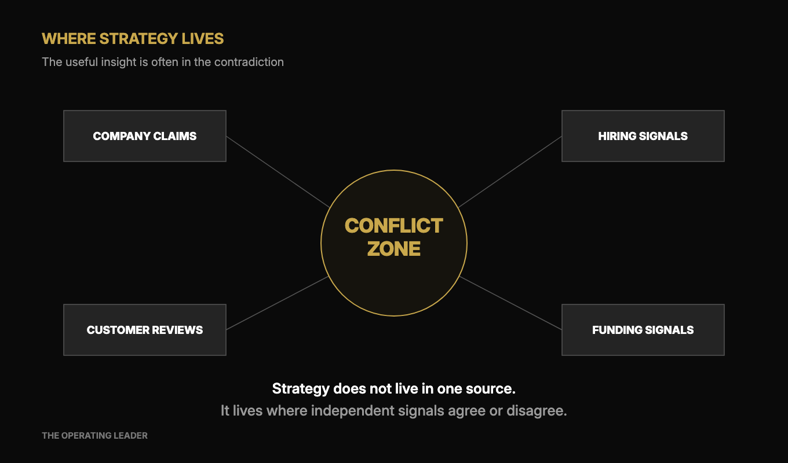

I used to think competitive research was a deck.

You know the one. Twenty-five slides. Logo grid. Feature checklist. Pricing table. A few quotes from customers. Maybe an analyst chart if someone had access.

Then it sits in a folder.

Sales asks for battlecards three weeks later. Product asks whether a competitor is actually winning in a segment. Marketing asks what customers complain about in the category. The board asks where the market is going.

And everyone goes back to opinions.

A salesperson lost a deal. A customer mentioned a competitor. A founder has a strong view. Someone saw a LinkedIn post. Useful signals, yes. Enough to make strategy, no.

In a recent strategy project, I wanted to test a different approach. What if competitive research was not a quarterly artifact, but a living intelligence base?

Not "I asked AI to do competitive research."

That is too shallow.

The work was closer to building a lightweight competitive intelligence system, using public data, review data, customer sentiment, company signals, hiring signals, funding data, product analysis, and agent-assisted synthesis.

The output was something a product leader could actually use. Strategy. Positioning. Roadmap choices. Sales enablement. Board-level thinking.

Old way: brief consultants, wait weeks, get a polished deck.

New way: one operator with the right tools can build an intelligence base, interrogate it, refresh it, and turn it into decisions.

## The wrong question

Most competitive research starts with the wrong question.

"Who are our competitors?"

That gives you a list. It does not give you strategy.

The better question is: how do we understand the market well enough to make better decisions?

That changes the work completely.

Now you are asking:

1. **Where is the category going?** Not what competitors claim, but where investment, customer pain, and product movement are pointing.
2. **Which competitors are real threats?** Some look dangerous because of positioning. Some are dangerous because of product depth. Those are not the same thing.
3. **Which segments are over-served or under-served?** The answer often hides in complaints, pricing gaps, and switching stories.
4. **What do customers actually complain about?** Not what your team thinks they complain about. What they say publicly, repeatedly, across vendors.
5. **Where are companies investing?** Hiring, product launches, funding, partnerships, and public messaging all leave trails.
6. **Which strategic bets have evidence underneath?** Attractive stories are cheap. Evidence is harder.

That last one matters most.

Inside most companies, competitive knowledge is scattered across people's heads. Sales has anecdotes. Customer success has escalation patterns. Product has assumptions. Executives have market narratives. The board has pressure points.

The problem is not that any of these are wrong.

The problem is that they are usually unweighted.

One loud lost deal can distort a roadmap. One impressive competitor launch can create panic. One board comment can turn into a strategy slide. One internal belief can survive long after customers have moved on.

The job is to move from anecdote to evidence.

## What we built

The system had two layers.

The first layer was a strategic competitive research base.

It included market context, competitor profiles, comparison matrices, funding and ownership data, pricing and packaging, product surface mapping, AI posture, adjacent revenue opportunities, ecosystem analysis, hiring signals, company scale, and public financial indicators where available.

The second layer was a voice-of-customer competitive analysis system.

We pulled public reviews and posts from multiple public sources, normalized them, tagged them against a product taxonomy, classified praise and complaint signals, and turned the result into dashboards.

One dashboard focused on a single company. Another compared multiple vendors side by side across the same taxonomy.

The most valuable part was not the data collection. It was the connection between the two layers.

Company claims said one thing.

Customer reviews said another.

Hiring patterns said a third.

Funding and ownership signals added another layer.

Product positioning added one more.

When those signals agreed, confidence went up. When they conflicted, the conflict became the work.

That is where competitive intelligence becomes useful. Not when it gives you more information, but when it shows you where your beliefs are fragile.

## The system behind it

The tool stack was deliberately practical.

AI coding and research agents did structured investigation, synthesis, and iteration. Netrows API helped turn scattered public company signals into queryable data. Open web research was used for validation and source triangulation. Browser automation filled gaps where APIs were incomplete. Python scripts handled parsing, cleaning, deduping, tagging, and aggregation. JavaScript scripts collected public web and app-store data. Markdown became the durable research base. HTML dashboards became the executive interface.

Important detail: AI was not the system.

AI was one part of the system.

The value came from combining agents, APIs, scripts, public data, and product judgment.

The process looked roughly like this.

## Start with decisions

We started by writing the strategic questions before collecting the data.

That sounds obvious. It is the step most people skip.

If you start with data, you drown. Every competitor has a website. Every review site has noise. Every product page has claims. Every LinkedIn profile creates another trail.

So we started from the decisions a product leader actually needs to make.

Which segment should we defend? Where is the next growth curve? Which product gaps are hurting trust? Where is AI real, and where is it mostly positioning? What would change our strategy if it were true?

Those questions shaped the taxonomy, the competitor list, the data sources, and the dashboards.

Without that step, you do research theatre.

Lots of screenshots. Lots of notes. No decision.

## Map the real competitor universe

The obvious competitors are rarely the full market.

We mapped direct competitors, adjacent competitors, smaller insurgents, enterprise alternatives, regional specialists, and ecosystem players.

This prevented the classic mistake: comparing only against the companies everyone already names.

Customers do not think in your category boundaries. They graduate to different tools. They substitute with adjacent systems. They assemble best-of-breed stacks. They stay with spreadsheets longer than you expect. They switch to a regional specialist because support speaks their language.

If your competitive map only includes the three companies your sales team mentions most often, you are probably missing the real movement in the market.

So every company went through the same frame: origin, ownership, scale, ICP, pricing, product surface, AI maturity, adjacent revenue, go-to-market, hiring, customer sentiment, risks, leadership, and strategic relevance.

Consistency mattered more than polish.

When each competitor is analyzed through the same lens, comparison becomes possible. Without that, every profile becomes a different essay and the executive team still has to do the real work manually.

## Turn reviews into evidence

The voice-of-customer layer was the part that made the work feel different.

We collected public reviews and posts from review sites, app stores, community forums, public customer review feeds, and company pages. Then we normalized them into a common structure.

Each review became a record:

1. **Source**
2. **Date**
3. **Vendor**
4. **Rating or sentiment**
5. **Feature tags**
6. **Praise or complaint classification**
7. **Original text link**

Then we tagged reviews against a product taxonomy: billing, payments, mobile app, support, onboarding, reliability, messaging, automation, integrations, analytics, and similar surfaces.

This changed the conversation.

Instead of "customers seem unhappy with reporting," we could ask: which vendors get reporting complaints, in which sources, over what time period, and in what exact words?

Instead of "competitor X has weak support," we could compare complaint density across support, onboarding, mobile, reliability, and billing.

Instead of "AI is everywhere now," we could separate real product usage signals from marketing language.

The first dashboard used 1,230 tagged public review records for one company. The multi-vendor version compared 8 vendors across 16 feature categories, 6 public sources, and 3,790 tagged records.

Were the numbers perfect? Of course not.

Public review data is biased. Angry customers are more likely to post. Review platforms have their own incentives. App-store reviews over-index on mobile problems. Reddit over-indexes on frustration and edge cases.

But internal customer data has bias too. Customer success data over-indexes on active customers and escalations. Sales data over-indexes on deals in motion. Product discovery over-indexes on whoever you managed to interview.

The answer is not to pretend one source is pure.

The answer is to compare sources and look for pattern overlap.

## Find the contradiction

The best moments in the work came when signals disagreed.

A company claimed strong automation depth, but customer reviews complained about manual workarounds.

A competitor positioned as an enterprise solution, but hiring signals suggested more investment in support and implementation than in product depth.

A vendor looked noisy in the market, but review volume and customer language suggested weaker category relevance than the messaging implied.

Another looked boring from the outside, but customer sentiment showed deep trust in a narrow segment.

These contradictions are the gold.

A normal competitive deck smooths them out. A living intelligence system keeps them visible.

Because strategy often lives in the gap between what a company says, what customers experience, where people are hired, and where money flows.

If all four point in the same direction, you probably have a real signal.

If they conflict, you have a question worth taking to customers, sales, product, or the board.

## What changed for each team

For the CPO, the system turned competitive research into strategy.

You could pressure-test roadmap bets, separate real threats from noise, and ask whether customer pain mapped to revenue opportunity. You could challenge the seductive trend that had no evidence underneath.

For product managers, it created feature-level evidence.

Not "customers want better reporting." Which customers complain, which vendors fail, which words they use, and how often the issue appears.

For product marketing, it sharpened positioning.

You could see where competitors were overclaiming, where customers felt disappointed, and where your strengths were actually recognized by the market.

For sales, it created battlecards grounded in customer language.

Not internal slogans. Real complaints. Real tradeoffs. Real reasons a buyer might switch.

For customer success, it separated category-wide pain from company-specific pain.

That changes how you handle escalations. If everyone in the category struggles with a workflow, the conversation is different from "only we are bad at this."

For executives and boards, it turned market narrative into evidence.

Much better than a slide saying "AI is transforming the category" with nothing underneath.

## The real time difference

Without AI agents, APIs, and automation, this would have been an expensive multi-person project.

You would need a product strategy lead, one or two analysts, someone technical for scraping and dashboards, product or PMM input for taxonomy and interpretation, and weeks of review.

Conservatively, 250 to 500+ hours of work. More if done by consultants. Probably 6 to 10 weeks from kickoff to a polished deliverable.

With agents, APIs, and scripts, one person could direct the work in focused bursts.

The human job changed.

Less manual collection. More question design.

Less copy-paste. More inspection.

Less formatting. More judgment.

The operator still has to know what matters. In fact, judgment matters more now, not less.

AI can collect, structure, compare, and summarize at speed. It cannot know which strategic question matters unless you frame it. It cannot tell you which politically convenient conclusion is dangerous unless you challenge it. It cannot replace product leadership.

It amplifies the parts of product leadership that were already scarce.

Question quality. Pattern recognition. Strategic judgment. The courage to demote a beautiful story when the evidence does not support it.

## Where to start

If I were building this again from zero, I would not start with a big system.

I would start with one decision.

Pick a question your company keeps debating:

1. **Which competitor is actually the biggest threat in this segment?**
2. **Which product gap is hurting trust the most?**
3. **Where are customers most frustrated across the category?**
4. **Is this trend real, or just market noise?**

Then build the smallest evidence base around that question.

Choose 5 competitors. Pull 200 to 500 public reviews from different sources, including Capterra, G2, TrustPilot, Reddit, Apple or Google Play app store. Create one taxonomy. Tag manually at first if needed. Add company signals. Build one comparison view. Use it in one product or strategy discussion.

If it changes the decision, expand it.

If it only confirms what everyone already knew, either your question was too weak or your sources were too narrow.

The goal is not to build the perfect competitive intelligence machine.

The goal is to stop making market decisions from scattered anecdotes.

Competitive research used to be a department, a consulting project, or a quarterly deck. Now it can be an operating muscle.

The advantage is no longer access to information. Everyone has information.

The advantage is asking better questions, building repeatable systems, and having the judgment to turn messy signals into action.

---

*This article is the long-form version of an issue of [The Operating Note](https://www.operatingleader.com/subscribe), bi-weekly, ~5-minute read, one operating insight at a time.*
